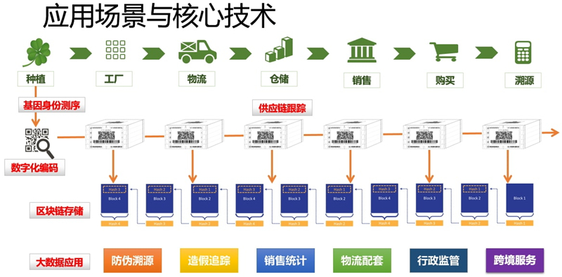
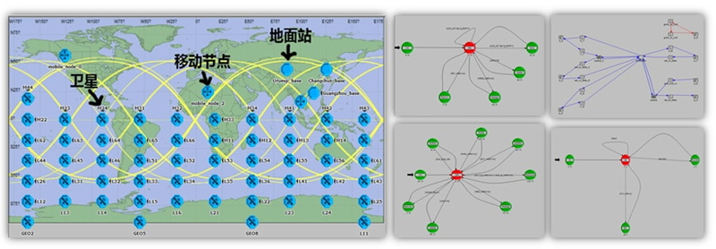

系统展示
=====================

研究组坚持理论结合实际的理念，面向交通、旅游、医药、军工等领域，在合作单位的支持下进行了多项实际工程系统的研发工作。我们认为，研究和创新不仅仅是通过发论文来体现，更重要的是能够学以致用，将学术界的最新成果投入解决应用中的科学和工程问题。 以下是我组部分研究工作的展示，内容均来源于实际应用。

限于页面空间，想了解更多相关的创新工作和专利技术，欢迎联系我们！

- **重载型列车宽带无线通信设备认证授权系统（应用领域：铁路重载货运）**

----------

- **重载型列车宽带无线通信设备网络测试系统（应用领域：铁路重载货运）**

----------

- **基于低功耗无线物联网的设备货物监测系统（应用领域：货运安全监测）**

----------

- **基于蓝牙和微信的室内定位与信息推送系统（应用领域：室内场景如场馆、会展、商场、医院）**

----------

- **面向生物领域产品物流溯源的移动应用系统（应用领域：动、植物类消费品如中草药）**

----------

- **面向生物领域产品供应链的区块链数据系统（应用领域：动、植物类消费品如中草药）**

----------

- **面向专用领域云计算与图像大数据分析系统（应用领域：军工或民用）**

----------

- **面向异构空间信息网络的联合仿真验证系统（应用领域：军工领域）**

----------

- **基于iBeacon/Eddystone的室内位置服务App（Google公司支持的大学生创新创业作品）**

