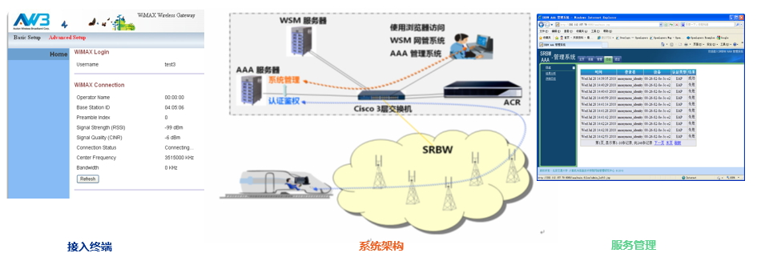
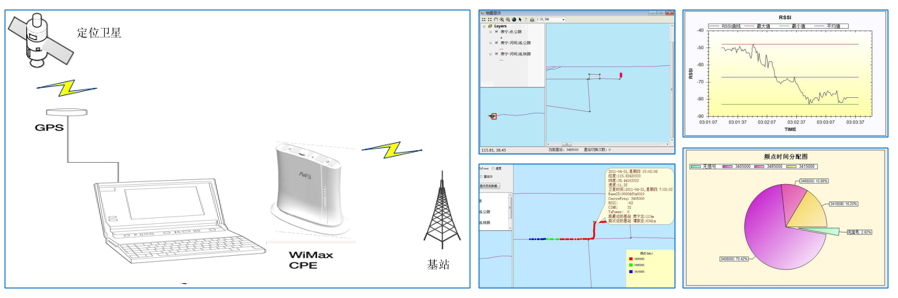
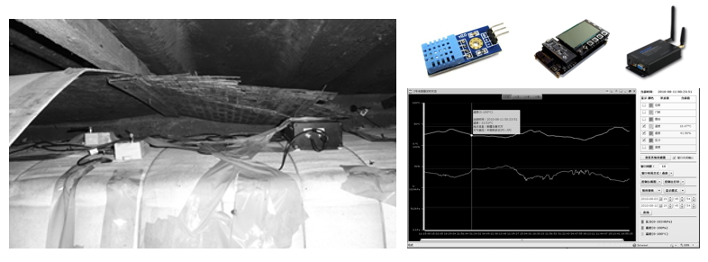
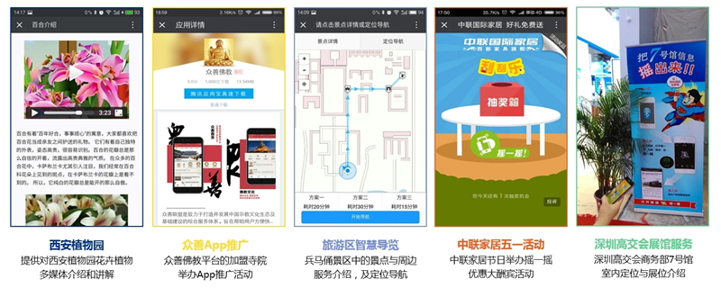
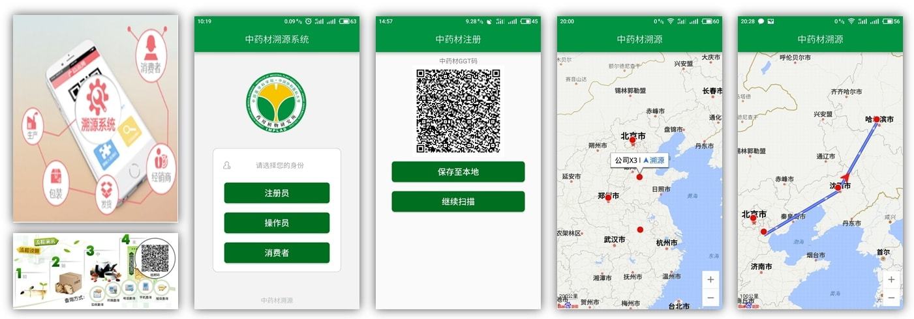
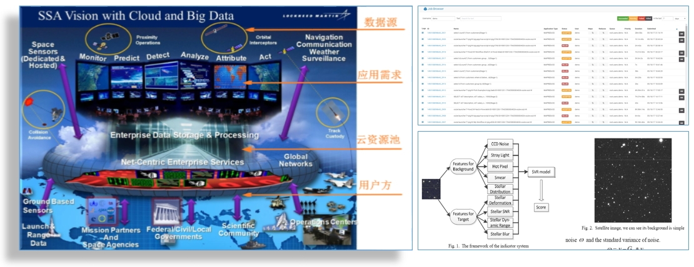
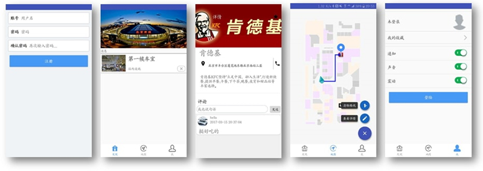

系统展示
=====================

研究组坚持理论结合实际的理念，面向交通、旅游、医药、军事等领域进行了多项实际工程系统的研发工作。我们认为，研究和创新不仅仅是通过发论文来体现，更重要的是能够学以致用、解决应用中的实际问题。

限于页面空间，想了解更多相关的创新工作和专利技术，欢迎联系我们 [wwfang at bjtu.edu.cn]！

- **重载型列车宽带无线通信设备认证授权系统（应用领域：铁路重载货运）**

----------

- **重载型列车宽带无线通信设备网络测试系统（应用领域：铁路重载货运）**

----------

- **基于低功耗无线传感网的设备货物监测系统（应用领域：铁路货运）**

----------

- **基于蓝牙和微信的室内定位与信息推送系统（应用领域：室内场景如场馆、会展、商场、医院）**

----------

- **面向专用领域产品溯源跟踪的移动应用系统（应用领域：动植物类产品如中草药）**

----------

- **面向专用领域云计算与图像大数据分析系统（应用领域：军事或民用）**

----------

- **基于iBeacon/Eddystone的室内位置服务App（本科生大创作品，获Google公司支持）**

