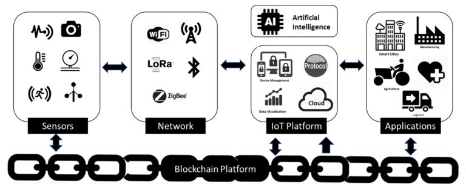

## 研究内容

----------

## 招生说明

 我们是一个**普通**，但是**做事，做实事，做真事**的科研团队，希望聚集一批个性简单，诚实乐观，自我驱动，热爱研发，肯做事能做事的同学一块儿学习和奋斗。 欢迎 全日制硕/博 和 本科实习生 加入我们，简历请至fangww@bjtu.edu.cn或fangvv@qq.com。 [在读学生及毕业去向](members.html)，[科研环境与学术活动](https://share.weiyun.com/5mc24pC)。

# 诚信为人之本，如同学你仅是为了寻找一个备胎学校或备胎导师，请勿浪费我的时间和精力，谢谢。 #

招收**全日制**硕士生(<=4人/年)的说明(**根据前期血泪教训总结**)

> **保研生请注意**：据学院往年数据，**推免的学硕（学制3年）优先985/211高校且该校学科评估结果为C+及以上的学校生源，因此优先招收**。同时，我校专硕学制2年，时间之短实难以保证培养质量，故原则上不招收。 **考研生请注意**：学院生源好，**计科不招收调剂生，请勿联系**。

- 具体要求：
 1. 缺乏执行力、言胜于行、热衷社交旅游、心理素质差、过于内向、(女生)爱哭易抑郁的**请勿联系**。
 1. 对付、造假、混，或在读期间长期在外实习，炒股，备考证券等从业资格考试的，**请勿联系**。
 1. 确认自己具有做理论研究或工程研发的**信心**和**能力**，**一定要会编程爱编程，尤其是女生**！

招收**全日制**博士生(<=1人/年)的说明

- 在满足以上硕士招生要求基础上：
 1. **读不读博士**，建议首先读一读多伦多大学李葆春教授的随笔[**飞蛾扑火**](https://fangvv.gitee.io/homepage/feph.jpg)，再思考决定。
 1. **数学和英语，绝对不能差，不能差，不能差**，因为导师绝对不会替你推公式，写文章。
 1. 建议提前读一读[《科研有方：科研需要“想好”再“做”》](https://book.douban.com/subject/26732439/)这本书。
 1. 学院毕业要求参考[截图](phdpaper.jpg)，对比本组论文列表[地址1](publication.html), [地址2](http://faculty.bjtu.edu.cn/8530/)，可知只要师生共同努力，毕业并不难。

招收我校**本科实习生**(<=3人/年)的说明(**根据前期血泪教训总结**)

- 希望你是一个**有点儿技术追求，爱折腾，有时间，有想法**的学生，且学有余力，热爱编程。
- 成绩排名较前的同学普遍要求高、想法多且缺少感恩之心，伺候不起，请优先考虑其他大牛老师。

----------

## 经验汇编

> 在我当学生的时候，也曾有过类似的诸多问题，却往往无人解答。后来发现国外导师们通常会在主页上提供学习指南供学生参考。由于国情和生源的差异，因此我注意在平时积累了一些接地气的中文资源，希望能对学生有用。内容来源于网络，版权属于原作者，仅供参考。

- 最基本的素养：独立思考解决问题的能力，编程实现能力，团队合作能力，英文阅读理解能力，逻辑思维能力，搜索引擎和学术数据库使用能力
- 最重要的原则：**失败后获得的教训和成功后获得的经验同样重要([中国航天的历次失败总结](https://www.bilibili.com/video/av19791318/))，我们不强求成功，坚决不能为了发表成果而做出急功近利的事情**
- 如何看待成功：[张晓东教授: 对社会和他人的贡献是检验成功的重要标准](ZXD-Success.pdf)
- 如何规划自己的科研人生：[熊辉教授牛文——为什么人前进的路总是被自己挡住](http://blog.sciencenet.cn/blog-800393-623681.html)
- 如何做研究（方法学）：[像外行一样思考，像专家一样实践——科研成功之道](http://book.douban.com/subject/1867455/ "像外行一样思考，像专家一样实践——科研成功之道")
- 如何做研究：[麻省理工学院人工智能实验室如何做研究的中文版](https://wenku.baidu.com/view/92ca9bde7cd184254a3535ab.html)
- 如何做研究：[零点花园科研经验集锦](research-experiences.pdf)
- 如何做研究：[刘知远：好的研究想法从哪里来](https://zhuanlan.zhihu.com/p/93765082)
- 如何读研究生：[哥伦比亚大学应用物理学教授赫曼提出的赫曼法则（The Laws of Herman）](http://blog.sciencenet.cn/home.php?mod=space&uid=41757&do=blog&id=1099644)
- 如何读研究生：[王汎森：如果让我重做一次研究生](https://cul.qq.com/a/20171014/018545.htm)
- 如何读博士：[博士生实用技巧 Practical Tips for Doctoral Students](practical_tips_for_doctoral_students.pdf)
- 如何看待师生关系：[迷时师渡，悟了自度 侯捷](https://nieyong.github.io/wiki_ny/%E8%BF%B7%E6%97%B6%E5%B8%88%E5%BA%A6%20%E6%82%9F%E4%BA%86%E8%87%AA%E5%BA%A6.html)
- 在没有导师的指导下，研究生如何阅读文献、提出创见、写出论文？：[王鸿伟博士的回答](https://www.zhihu.com/question/23647187/answer/568803695)
- 如何读博士生：[《科研有方：科研需要“想好”再“做”》](https://book.douban.com/subject/26732439/)
- 如何作系统和网络领域的研究：[Prof. Srinivasan Keshav @ UWaterloo](ResearchAdvice.pdf)
- 如何看待论文：[Yuanyuan Zhou教授对Elon Musk的“大部分学术论文是无用的”观点的评价](https://www.quora.com/Is-Elon-Musk-right-in-saying-most-academic-papers-are-useless/answer/Yuanyuan-Zhou?srid=ZqR9)
- 如何看待论文：[在XX界，为什么论文灌水现象越来越严重？似乎已经没有干货了？](https://www.zhihu.com/question/39342238/answer/99408954)
- 如何读论文：[Prof. Srinivasan Keshav @ UWaterloo](http://blizzard.cs.uwaterloo.ca/keshav/home/Papers/data/07/paper-reading.pdf "链接")
- 如何读论文：[韦庆媛：文献阅读与论文写作](韦庆媛文献阅读与论文写作.pdf)
- 研究生新生要怎么看论文：[链接](https://www.zhihu.com/question/304334959 "链接")
- 如何写论文(宏观角度)：[微软Simon Peyton Jones的建议](https://www.microsoft.com/en-us/research/academic-program/write-great-research-paper/ "微软Simon Peyton Jones的建议")
- Writing Perfect Papers：[多伦多大学李葆春教授的建议](http://isn.xidian.edu.cn/info/1003/2388.htm "多伦多大学李葆春教授的建议")
- 如何写论文(微观角度)：[山世光老师的建议](http://www.jdl.ac.cn/user/sgshan/PaperWriting.pdf "山世光老师的建议")
- 如何写论文(机器翻译, 其它方向亦可参考)：[清华刘洋老师的建议：学术论文写作方法和技巧](http://nlp.csai.tsinghua.edu.cn/~ly/talks/cwmt14_tut.pdf "刘洋老师的建议")
- 如何写论文：[一篇论文的组织结构是怎样的，每部分表达什么意思](paper-organization.jpg)
- 如何写论文：[张华平老师：科技论文写作小经验漫谈](科技论文写作小经验漫谈.ppt)
- 如何做报告：[多伦多大学李葆春教授的建议](http://www.cs.cityu.edu.hk/~jia/research/the-art-of-presentation.pdf "多伦多大学李葆春教授的建议")
- 如何与导师有效沟通你的论文选题：[王树义教授的经验](http://blog.sciencenet.cn/blog-377709-1202867.html)
- 如何论文开题：[论文开题报告怎么写](https://www.zhihu.com/question/19891472)
- 如何利用时间：[暗时间@刘未鹏](http://mindhacks.cn/2009/12/20/dark-time/ "暗时间")
- 如何做好学术PPT：[一些方法](https://www.zhihu.com/question/22446174)
- 如何提问：[别像弱智一样提问](https://github.com/tangx/Stop-Ask-Questions-The-Stupid-Ways)
- 如何开始研发工作：[陶哲轩 Write a rapid prototype first](http://www.phy.pku.edu.cn/~wangdy/courses/howtophd/WriteARapidPrototypeFirst.pdf) 动手，动手，动手！
- 如何提高基础的数据结构和算法的理解能力：我推荐认认真真学习[GeeksforGeeks](https://www.geeksforgeeks.org/)上的主题知识
- 如何开展研究工作：[发现自己的研究方向没啥可做的？](https://www.zhihu.com/question/268787249)
- 如何阅读程序源码：[潘爱民老师的分享](HowToReadSourceCode.pdf)
- 如何利用好Google Scholar：[谷歌学术](https://www.zhihu.com/question/39852481)
- 如何作好CS专业课外阅读：[我坚信这个世界应该不只有AI和炼丹](https://mp.weixin.qq.com/s/EjgtX2Wghia7ajn2AugCtw)
- 如何写一篇**失败**的学位论文：[不合格学术型硕士研究生学位论文的典型特征](不合格学术型硕士研究生学位论文的典型特征-基于论文抽检专家评阅意见的分析.pdf)
- 如何看待中国大学：[李志文教授牛文——漫谈二流大学](https://blogs.harvard.edu/guorui/2015/08/13/%E6%9D%8E%E5%BF%97%E6%96%87%EF%BC%9A%E6%BC%AB%E8%B0%88%E4%BA%8C%E6%B5%81%E5%A4%A7%E5%AD%A6%EF%BC%88%E6%B8%85%E5%8D%8E%E5%8C%97%E5%A4%A7%E6%B5%99%E5%A4%A7%E5%8F%AA%E6%98%AF%E4%B8%89%E6%B5%81%E5%A4%A7/)
- 如何正视中国科研：[科技日报总编辑刘亚东：除了那些核心技术，我们还缺什么？](https://tech.qq.com/a/20180622/024862.htm)
- 如何正视中国科研：[中科院教授来信：为什么中国科学技术远落后于美国？](http://www.elecfans.com/d/710697.html)
- 如何正视中国科研：[不要培养人格低下的知识分子](http://www.sohu.com/a/124240276_354611)
- 如何正视中国科研：[科学家的价值不只在SCI期刊里](http://zqb.cyol.com/html/2019-04/15/nw.D110000zgqnb_20190415_2-08.htm)
- 如何正视中国科研：[独立和自由是最宝贵的学者精神](https://mp.weixin.qq.com/s/KGx5y6gAhLWeNMswlR1oKw)
- 如何看待人工智能：[人工智能是当前最好的计算机专业吗?](https://www.zhihu.com/question/331449600/answer/737885701)
- 如何看待中国学生：[普林斯顿中国籍教授：中国学生是怎样被一步步淘汰掉的？](https://cloud.tencent.com/developer/article/1422738)
- 如何看待中国学生：[钱理群：大学里绝对精致的利己主义者](https://edu.qq.com/a/20150520/041737.htm)
